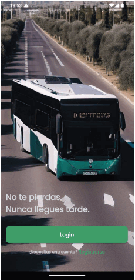

<!-- Improved compatibility of back to top link: See: https://github.com/othneildrew/Best-README-Template/pull/73 -->

<!--
*** Thanks for checking out the Best-README-Template. If you have a suggestion
*** that would make this better, please fork the repo and create a pull request
*** or simply open an issue with the tag "enhancement".
*** Don't forget to give the project a star!
*** Thanks again! Now go create something AMAZING! :D
-->

<!-- PROJECT LOGO -->
 

  

<h3 align="center">Bus On Time</h3>

  

    Flutter APP for Jaén-Martos line schedule control.
     
    <a href="https://github.com/adlopezruiz/busontime-app"><strong>Explore the docs »</strong></a>
     
     
    <a href="https://github.com/adlopezruiz/busontime-app">View Demo</a>
    ·
    <a href="https://github.com/adlopezruiz/busontime-app/issues">Report Bug</a>
    ·
    <a href="https://github.com/adlopezruiz/busontime-app/issues">Request Feature</a>
  

<!-- ABOUT THE PROJECT -->
## About The Project

  

Bus On Time is an application to keep the user informed of the
schedule of the Jaén-Martos bus line at any time and
stop. 
Its interface is very friendly for all types of users, taking into account
various display options for timetables, either along
traditional (consortium timetable), consulting the stop on a map
interactive or reviewing your favorite stops. 
It is based on the geolocation of the user so that he can
locate the nearest stop and check its schedules. 
In the hidden part of the project, we have one remaining API developed with NodeJS Express. 
The APP accesses the data in a hybrid way, launching direct requests to the
Firebase services, to take advantage of its reactivity or
launching requests to our Rest API, to get the data from
more specific way and thus saves the APP load of processes.

(<a href="#readme-top">back to top</a>)

<!-- Project Keys -->
## Project Technologies and keys

- Flutter BloC for state management.
- GetIt as dependency injection and service locator.
- GoRouter as page router.
- Atomic design.
- Google Maps integration.
- GeoLocator to track user position.

(<a href="#readme-top">back to top</a>)

<!-- LICENSE -->
## License

Distributed under the MIT License.

(<a href="#readme-top">back to top</a>)

<!-- CONTACT -->
## Contact

Adrián López - [@adrilopezdev](https://twitter.com/adrilopezdev) - adrianlopezruiz.dev@gmail.com@gmail.com

Project Link: [https://github.com/adlopezruiz/busontime-app](https://github.com/adlopezruiz/busontime-app)

(<a href="#readme-top">back to top</a>)

<!-- MARKDOWN LINKS & IMAGES -->
<!-- https://www.markdownguide.org/basic-syntax/#reference-style-links -->
[contributors-shield]: https://img.shields.io/github/contributors/adlopezruiz/busontime-app.svg?style=for-the-badge
[contributors-url]: https://github.com/adlopezruiz/busontime-app/graphs/contributors
[forks-shield]: https://img.shields.io/github/forks/adlopezruiz/busontime-app.svg?style=for-the-badge
[forks-url]: https://github.com/adlopezruiz/busontime-app/network/members
[stars-shield]: https://img.shields.io/github/stars/adlopezruiz/busontime-app.svg?style=for-the-badge
[stars-url]: https://github.com/adlopezruiz/busontime-app/stargazers
[issues-shield]: https://img.shields.io/github/issues/adlopezruiz/busontime-app.svg?style=for-the-badge
[issues-url]: https://github.com/adlopezruiz/busontime-app/issues
[license-shield]: https://img.shields.io/github/license/adlopezruiz/busontime-app.svg?style=for-the-badge
[license-url]: https://github.com/adlopezruiz/busontime-app/blob/master/LICENSE.txt
[linkedin-shield]: https://img.shields.io/badge/-LinkedIn-black.svg?style=for-the-badge&logo=linkedin&colorB=555
[linkedin-url]: https://linkedin.com/in/adrianlopezdev
[product-screenshot]: images/screenshot.png
[Next.js]: https://img.shields.io/badge/next.js-000000?style=for-the-badge&logo=nextdotjs&logoColor=white
[Next-url]: https://nextjs.org/
[React.js]: https://img.shields.io/badge/React-20232A?style=for-the-badge&logo=react&logoColor=61DAFB
[React-url]: https://reactjs.org/
[Vue.js]: https://img.shields.io/badge/Vue.js-35495E?style=for-the-badge&logo=vuedotjs&logoColor=4FC08D
[Vue-url]: https://vuejs.org/
[Angular.io]: https://img.shields.io/badge/Angular-DD0031?style=for-the-badge&logo=angular&logoColor=white
[Angular-url]: https://angular.io/
[Svelte.dev]: https://img.shields.io/badge/Svelte-4A4A55?style=for-the-badge&logo=svelte&logoColor=FF3E00
[Svelte-url]: https://svelte.dev/
[Laravel.com]: https://img.shields.io/badge/Laravel-FF2D20?style=for-the-badge&logo=laravel&logoColor=white
[Laravel-url]: https://laravel.com
[Bootstrap.com]: https://img.shields.io/badge/Bootstrap-563D7C?style=for-the-badge&logo=bootstrap&logoColor=white
[Bootstrap-url]: https://getbootstrap.com
[JQuery.com]: https://img.shields.io/badge/jQuery-0769AD?style=for-the-badge&logo=jquery&logoColor=white
[JQuery-url]: https://jquery.com 
